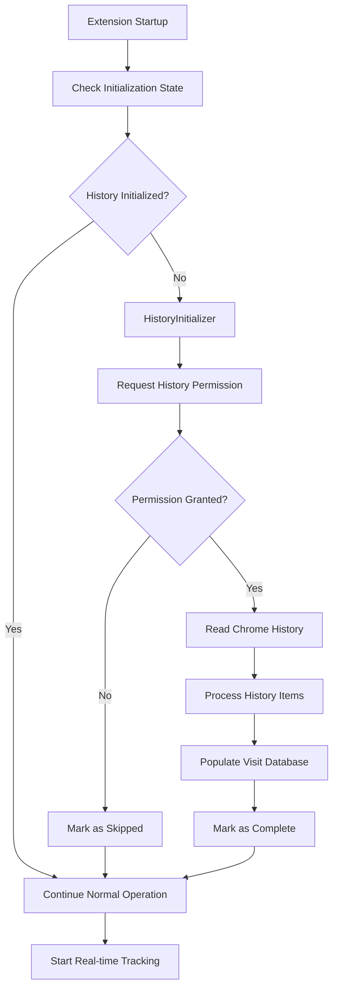

# Design Document

## Overview

The History Initialization feature extends the existing visit tracking system by populating the visit database with historical browsing data from Chrome's History API on first run. This provides immediate personalization of search results based on the user's past browsing patterns, rather than starting with an empty visit database.

The feature integrates seamlessly with the existing `VisitStorageManager` and `VisitTracker` components, using the same data structures and storage mechanisms while adding a one-time initialization process.

## Architecture

### Core Components

1. **HistoryInitializer**: Main component responsible for reading Chrome history and populating the visit database
2. **Permission Manager**: Handles dynamic permission requests for history access
3. **Initialization State Manager**: Tracks whether history initialization has been completed
4. **Integration Layer**: Coordinates with existing `VisitStorageManager` and `VisitTracker`

### Component Relationships



## Components and Interfaces

### HistoryInitializer Interface

```typescript
interface IHistoryInitializer {
  initialize(): Promise<void>;
  isInitializationNeeded(): Promise<boolean>;
  processHistoryItems(items: chrome.history.HistoryItem[]): Promise<IVisitData>;
  markInitializationComplete(): Promise<void>;
}
```

### Permission Manager Interface

```typescript
interface IPermissionManager {
  requestHistoryPermission(): Promise<boolean>;
  hasHistoryPermission(): Promise<boolean>;
  markPermissionDenied(): Promise<void>;
  wasPermissionDenied(): Promise<boolean>;
}
```

### Initialization State Interface

```typescript
interface IInitializationState {
  isHistoryInitialized: boolean;
  initializationDate?: number;
  permissionDenied?: boolean;
  historyItemsProcessed?: number;
}
```

## Data Models

### History Processing Data Flow

1. **Chrome History Item**: Raw data from `chrome.history.search()`
   ```typescript
   interface HistoryItem {
     id: string;
     url?: string;
     title?: string;
     lastVisitTime?: number;
     visitCount?: number;
     typedCount?: number;
   }
   ```

2. **Processed Visit Data**: Converted to match existing `IVisitData` format
   ```typescript
   interface IVisitData {
     [normalizedUrl: string]: {
       count: number;
       lastVisited: number;
       title?: string;
     };
   }
   ```

### Storage Keys

- `tidy_tabs_history_init_state`: Stores initialization state
- `tidy_tabs_visit_data`: Existing visit data storage (reused)

## Error Handling

### Permission Handling
- **Permission Denied**: Store preference and continue with real-time tracking only
- **Permission Revoked**: Gracefully degrade to real-time tracking
- **API Unavailable**: Log warning and continue with existing functionality

### History Processing Errors
- **Large History**: Process in batches of 1000 items to prevent memory issues
- **Invalid URLs**: Skip malformed URLs and continue processing
- **Storage Quota**: Use existing cleanup mechanisms in `VisitStorageManager`
- **Processing Timeout**: Implement timeout with partial completion

### Error Recovery
- **Partial Failure**: Save successfully processed items and mark as partially complete
- **Complete Failure**: Mark initialization as failed and retry on next startup
- **Storage Errors**: Use existing error handling in `VisitStorageManager`

## Testing Strategy

### Unit Tests
1. **HistoryInitializer Tests**
   - Test history item processing and normalization
   - Test batch processing logic
   - Test error handling for invalid data
   - Test integration with VisitStorageManager

2. **Permission Manager Tests**
   - Test permission request flow
   - Test permission state persistence
   - Test graceful degradation when denied

3. **Integration Tests**
   - Test complete initialization flow
   - Test interaction with existing visit tracking
   - Test storage format compatibility

### Mock Strategy
- Mock `chrome.history.search()` with various data scenarios
- Mock `chrome.permissions.request()` for permission testing
- Mock `chrome.storage.local` for state persistence testing
- Use existing test helpers for VisitStorageManager integration

### Test Scenarios
1. **First Run**: Empty visit database, successful history initialization
2. **Permission Denied**: User denies history permission, continues with real-time tracking
3. **Large History**: Process 10,000+ history items efficiently
4. **Partial Data**: Handle missing titles, invalid URLs, corrupted history
5. **Storage Limits**: Test behavior when approaching storage quota
6. **Subsequent Runs**: Verify initialization is skipped after completion

## Implementation Details

### Initialization Flow
1. Check if `tidy_tabs_history_init_state` exists in storage
2. If not initialized and visit database is empty, start initialization
3. Request history permission with clear user messaging
4. If granted, read history using `chrome.history.search()` with appropriate filters
5. Process history items in batches, normalizing URLs using existing logic
6. Aggregate visit counts for duplicate URLs
7. Store processed data using existing `VisitStorageManager.saveVisitData()`
8. Mark initialization as complete

### URL Normalization
- Reuse existing `normalizeUrl()` logic from `VisitStorageManager`
- Ensure consistency between history-derived and real-time visit data
- Handle edge cases like redirects and URL variations

### Performance Considerations
- Process history in chunks of 1000 items to prevent blocking
- Use `requestIdleCallback()` for non-blocking processing
- Implement progress feedback for large history processing
- Set reasonable limits (e.g., last 10,000 visits) to prevent excessive processing

### Integration Points
- Extend existing background script to trigger initialization
- Integrate with existing error handling via `ErrorManager`
- Use existing storage mechanisms and data validation
- Maintain compatibility with existing visit tracking workflow